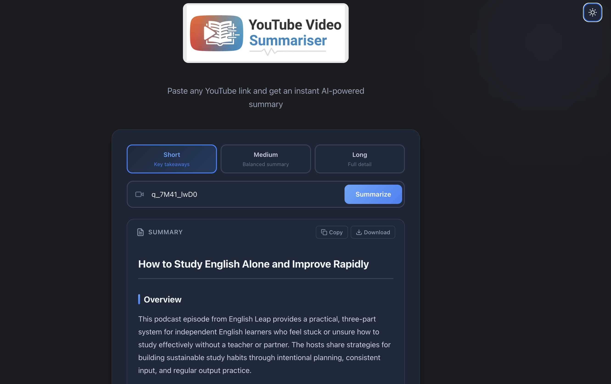
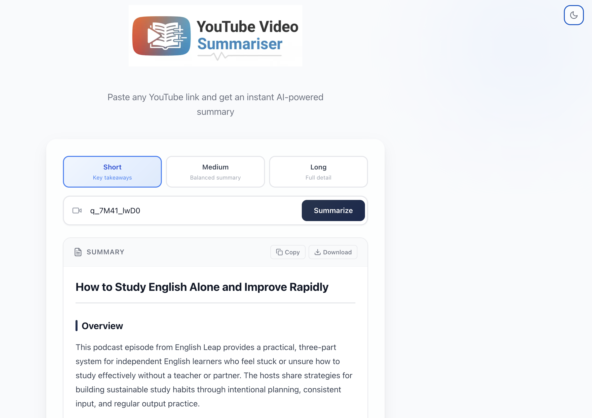

# YT Summarizer

Paste any YouTube link and get an instant AI-powered summary. YT Summarizer extracts video transcripts and uses Claude AI to generate well-structured, readable markdown summaries — streamed to your browser in real time.

## Preview

| Dark Mode | Light Mode |
|:---------:|:----------:|
|  |  |

## Tech Stack

- [Next.js 16](https://nextjs.org) with App Router
- [React 19](https://react.dev)
- [TypeScript](https://www.typescriptlang.org)
- [Tailwind CSS 4](https://tailwindcss.com)
- [Anthropic SDK](https://docs.anthropic.com) (Claude AI)
- [react-markdown](https://github.com/remarkjs/react-markdown) for rendering summaries

## Getting Started

### Prerequisites

- [Node.js](https://nodejs.org) 18.17 or later
- An [Anthropic API key](https://console.anthropic.com)

### Installation

```bash
git clone https://github.com/your-username/yt-summarizer.git
cd yt-summarizer
npm install
```

### Environment Setup

Create a `.env.local` file in the project root:

```env
ANTHROPIC_API_KEY=your_anthropic_api_key_here
ANTHROPIC_MODEL=claude-sonnet-4-5-20250929
ANTHROPIC_TEMPERATURE=0.7
WEBSHARE_PROXY_USERNAME=your_webshare_username
WEBSHARE_PROXY_PASSWORD=your_webshare_password
```

| Variable | Required | Default | Description |
|---|---|---|---|
| `ANTHROPIC_API_KEY` | Yes | — | Your Anthropic API key |
| `ANTHROPIC_MODEL` | No | `claude-sonnet-4-5-20250929` | Claude model to use |
| `ANTHROPIC_TEMPERATURE` | No | `0.7` | Controls response creativity (0–1) |
| `WEBSHARE_PROXY_USERNAME` | No* | — | Webshare proxy username |
| `WEBSHARE_PROXY_PASSWORD` | No* | — | Webshare proxy password |

> *\*Required for production/cloud deployments. See [FAQ](#faq) for details.*

### Run the Development Server

```bash
npm run dev
```

Open [http://localhost:3000](http://localhost:3000) in your browser.

### Build for Production

```bash
npm run build
npm start
```

## Features

- **Summary length selection** — choose between Short (key takeaways), Medium (balanced summary), or Long (full detail) before generating
- **Multi-language summaries** — generate summaries in 11 languages: English, Spanish, French, German, Portuguese, Japanese, Korean, Chinese, Hindi, Arabic, and Assamese. Language preference persists across sessions
- **Video metadata display** — see video title, channel name, thumbnail, duration, and view count before and alongside your summary
- **Clickable timestamps** — summaries include timestamps that link directly to the corresponding moment in the YouTube video
- **Share via URL** — share any summary with a single link that auto-generates the summary for the recipient
- **Server-side caching** — identical requests are served from cache, saving API costs and reducing latency
- **Real-time streaming** — summaries stream to your browser as they're generated
- **Copy to clipboard** — one-click copy of the full summary
- **Download as Markdown** — export any summary as a `.md` file
- **Dark / Light mode** — toggle between themes
- **Structured output** — summaries use consistent Markdown formatting with headings, bullet points, and blockquotes

## Usage

1. Paste a YouTube video URL into the input field.
2. Select a summary length — **Short**, **Medium**, or **Long**.
3. Choose a language for the summary output (defaults to English).
4. Click **Summarize**.
5. The AI-generated summary streams in real time with structured sections and clickable timestamps.
6. Use **Copy**, **Download**, or **Share** to save or share the result.

## Known Limitations

> **The live demo may not work reliably.** YouTube aggressively blocks requests from cloud/datacenter IPs (AWS, GCP, Vercel, etc.) with "Sign in to confirm you're not a bot" errors. Free proxy services (including Webshare's free datacenter proxies) are also blocked. A residential proxy (~$6/mo) would fix this, but I'm broke, so here we are.
>
> **To try the app, please run it locally** — your home IP is not blocked by YouTube. See [Getting Started](#getting-started) for setup instructions.

## Deployment

The easiest way to deploy is with [Vercel](https://vercel.com):

[](https://vercel.com/new)

Make sure to add your environment variables in the Vercel dashboard under **Settings > Environment Variables**.

> **Note:** For the deployed app to work, you will need a **residential proxy** service. See [FAQ](#faq) below.

## FAQ

### Why do I get "YouTube is blocking requests from this server" in production?

YouTube blocks requests from cloud provider IPs (AWS, GCP, Azure, etc.). Since platforms like Vercel run on AWS, YouTube rejects transcript requests from your deployed app. This does not happen during local development because your home IP is not blocked.

### Why don't free proxies work?

YouTube detects and blocks datacenter IPs regardless of the proxy provider. The [youtube-transcript-api maintainer tested multiple providers](https://github.com/jdepoix/youtube-transcript-api/discussions/335) and confirmed that only **residential proxies** reliably bypass YouTube's bot detection. Free datacenter proxies from Webshare, ProxyScrape, and others are all blocked.

### How do I fix it?

You need a **residential** proxy service so that requests to YouTube appear to come from a regular home IP. This project supports [Webshare](https://www.webshare.io) residential proxies (~$6/mo):

1. Sign up at [webshare.io](https://www.webshare.io) and purchase a residential proxy plan.
2. Copy your proxy username and password from the Webshare dashboard.
3. Add `WEBSHARE_PROXY_USERNAME` and `WEBSHARE_PROXY_PASSWORD` to your environment variables (both in `.env.local` for local testing and in your Vercel project settings for production).

### Do I need the proxy for local development?

No. The proxy is only needed when deploying to cloud platforms. Locally, your home IP works fine with YouTube. If the proxy env vars are not set, the app falls back to direct requests.

## Contributing

This project is actively evolving, and all contributions are welcome! If you have ideas for new features, improvements, or spot any issues, feel free to [open an issue](https://github.com/rajat-mehra05/yt-summarizer/issues) or submit a pull request. Feedback and suggestions of any kind are greatly appreciated.

## License

This project is licensed under the [MIT License](LICENSE).
